# linux-deepin
Hi i´m Harth
hola mundo 

## ejercicio de prueba
¿CÓMO INSTALAR DEEPIN EN VIRTUALBOX?
Deepin es una distribución basada en Debian que tiene como objetivo proporcionar un sistema operativo fácil de usar, fácil de usar y confiable. No solo incluye lo mejor que ofrece el mundo de código abierto, sino que también ha creado su propio entorno de escritorio llamado DDE, que se basa en el kit de herramientas Qt 5. Centra gran parte de su atención en el diseño intuitivo.

Características:
-Nueva interfaz gráfica         encantadora.

-Soporte para temas claros y oscuros.

-Gestión de notificaciones personalizada.

-Un nuevo administrador de fuentes.

Requerimientos:

Intel Pentium IV 2GHz o superior
Se recomienda más de 2G de RAM, 4G o superior
Mínimo 25 GB de espacio libre en disco

Paso 1: Abra Virtual Box, haga clic en presione en el botón nuevo.

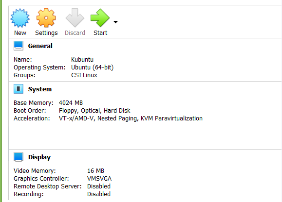

Paso 2: Escriba el nombre que desea para la máquina virtual y seleccione su tipo para la arquitectura Linux de 64 bits basada en Debian.

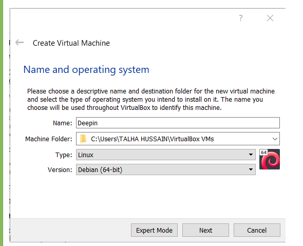

Paso 3: Asignar el tamaño de RAM a la Máquina Virtual de Deepin.  

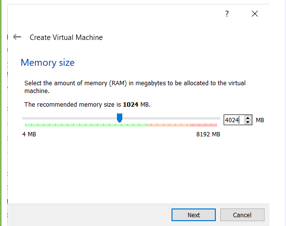

Paso 4: Seleccione la opción para crear un disco duro virtual ahora y luego presione el botón Crear.

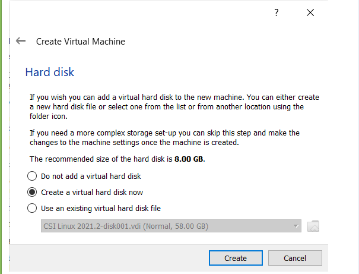

Paso 5: seleccione el tipo de archivo de disco duro para VDI.

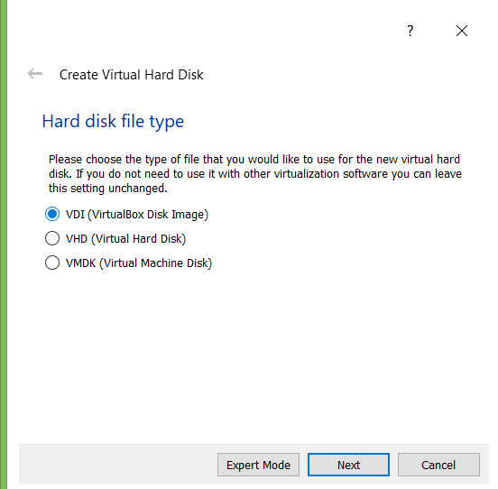

Paso 6: seleccione el tipo de almacenamiento en el almacenamiento del disco duro físico para asignarlo dinámicamente.

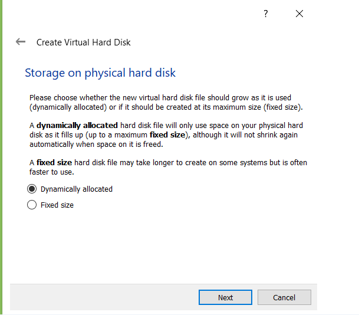

Paso 7: Seleccione el tamaño de su disco duro virtual y la ubicación donde desea guardar su máquina y sus archivos.

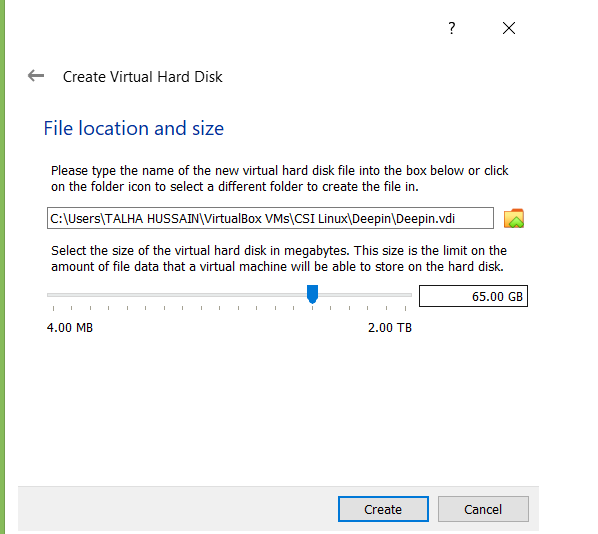

Paso 8: Haga clic en la opción del ícono de configuración ubicada arriba después de seleccionar la máquina deepin y seleccione su archivo ISO de Deepin descargado y luego haga clic en el botón de inicio.

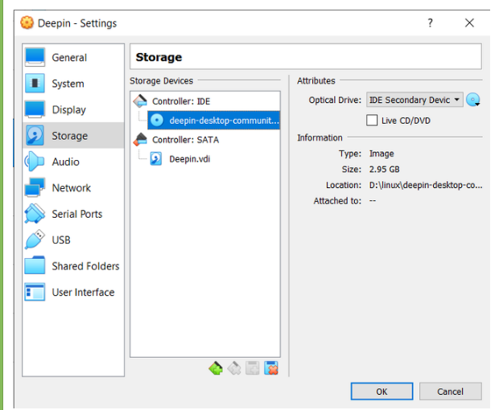

Paso 9: haga clic en el botón de inicio. Seleccione la primera opción y presione enter.

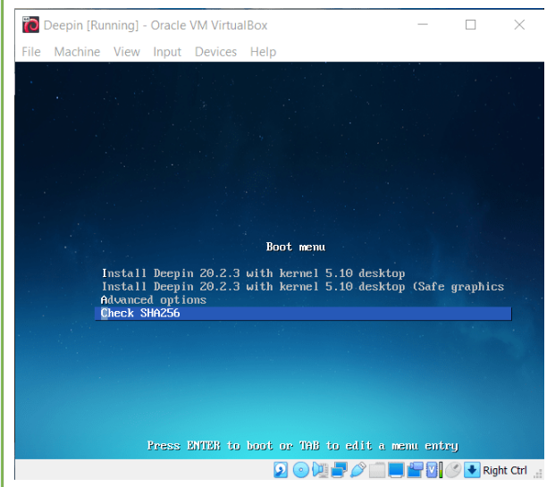

Paso 10: seleccione su idioma preferido para la configuración de la instalación.

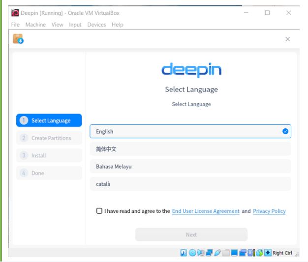

Paso 11: Seleccione / dev / sda i con y haga clic en siguiente.

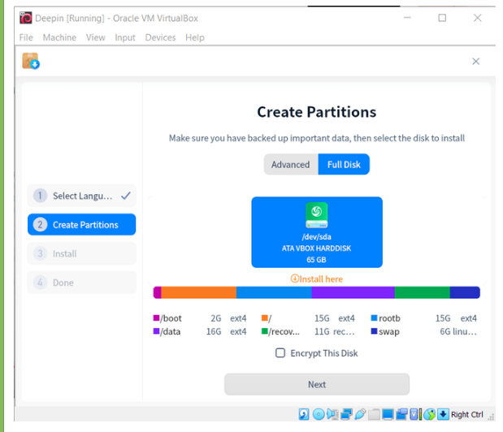

Paso 12: Haga clic en continuar si no desea una copia de seguridad para restaurar el sistema; de lo contrario, marque su casilla.

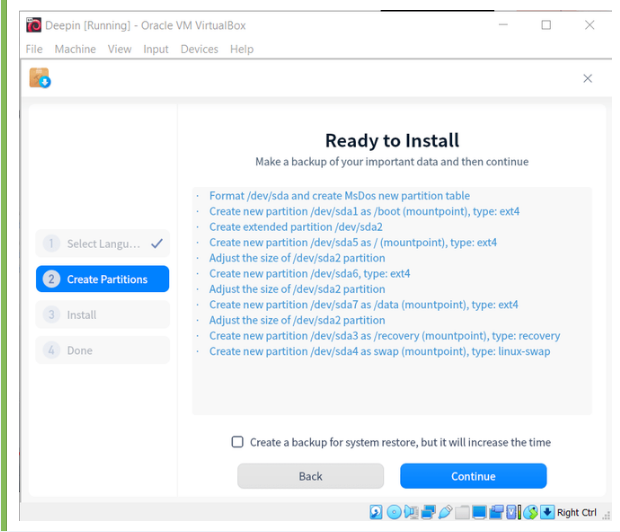

Paso 13: Espere a que finalice la instalación.

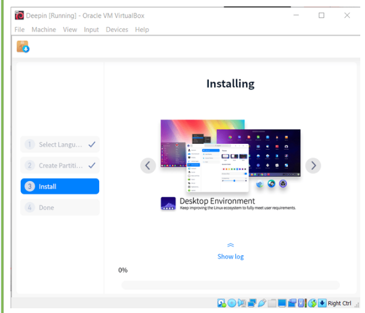

Paso 14: Después de una instalación exitosa, reinicie Deepin.

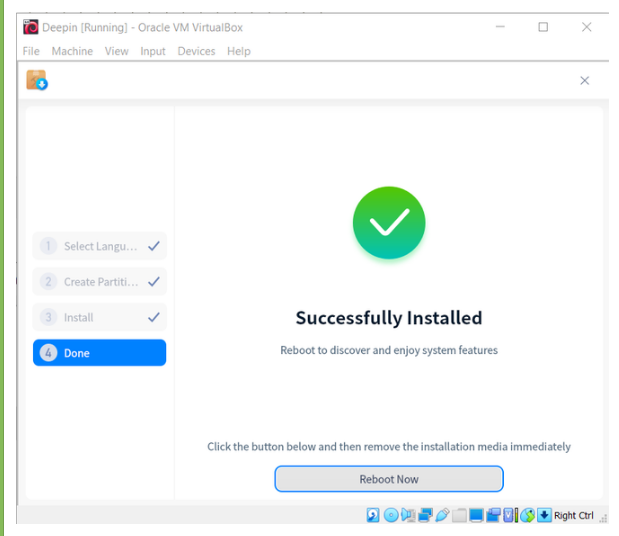

Paso 15: Seleccione su idioma y haga clic en siguiente

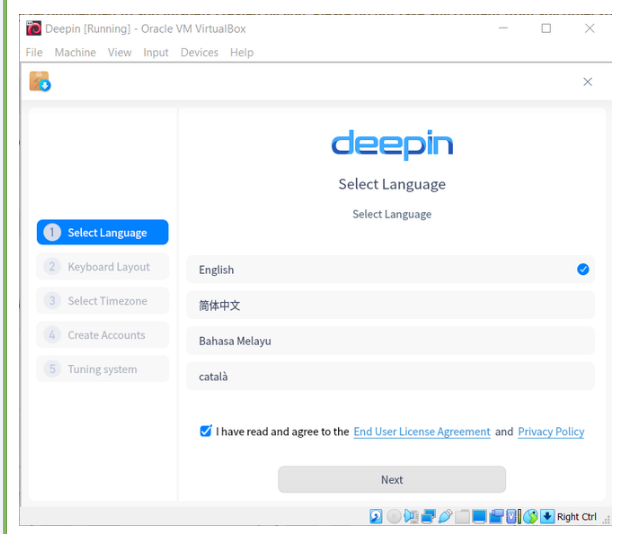

Paso 16: Seleccione la distribución de su teclado y presione continuar.

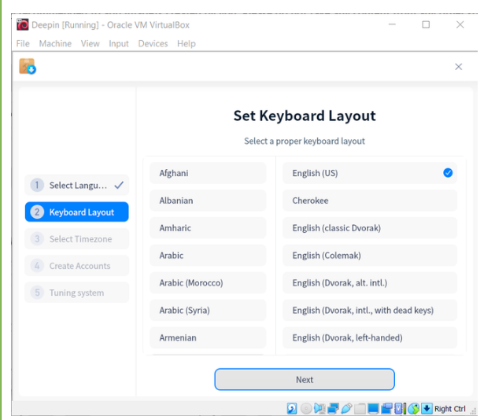

Paso 17:   Selecciona tu ubicación y presiona continuar.

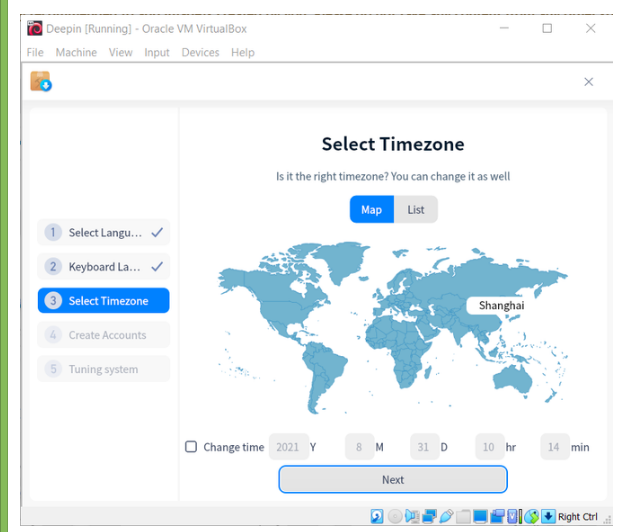

Paso 18: Escriba su nombre de usuario y el nombre de su computadora. Elija una contraseña segura que se le pedirá cada vez que usted o cualquier otra persona intente acceder a Deepin. Haga clic en continuar.

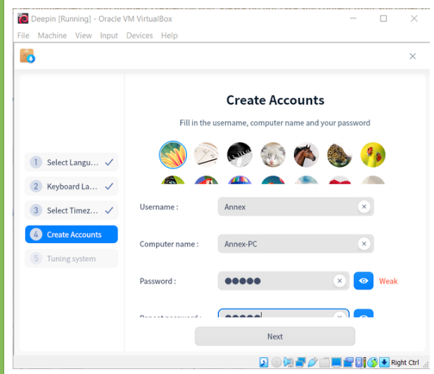

Paso 19: Ahora espere a que se apliquen los cambios. 

Paso 20: Después de que se aplicaron los cambios, se le pedirá que ingrese sus credenciales para iniciar sesión.

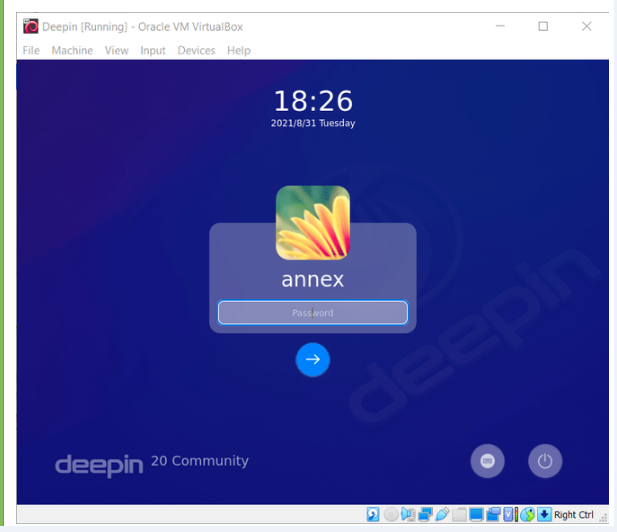

Ahora exploremos, en la parte inferior podemos ver el icono del iniciador de aplicaciones, el icono de configuración, el calendario, etc.

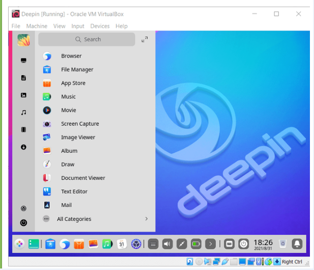

Abra la terminal e ingrese algunos comandos básicos.

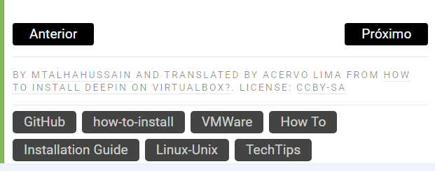

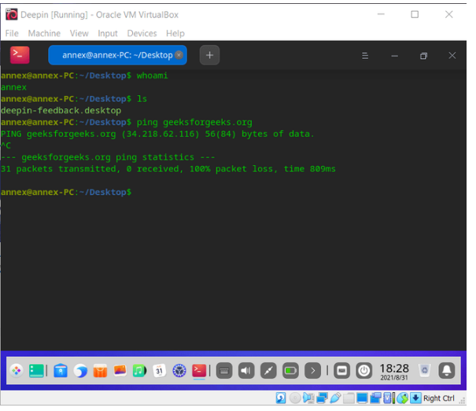

